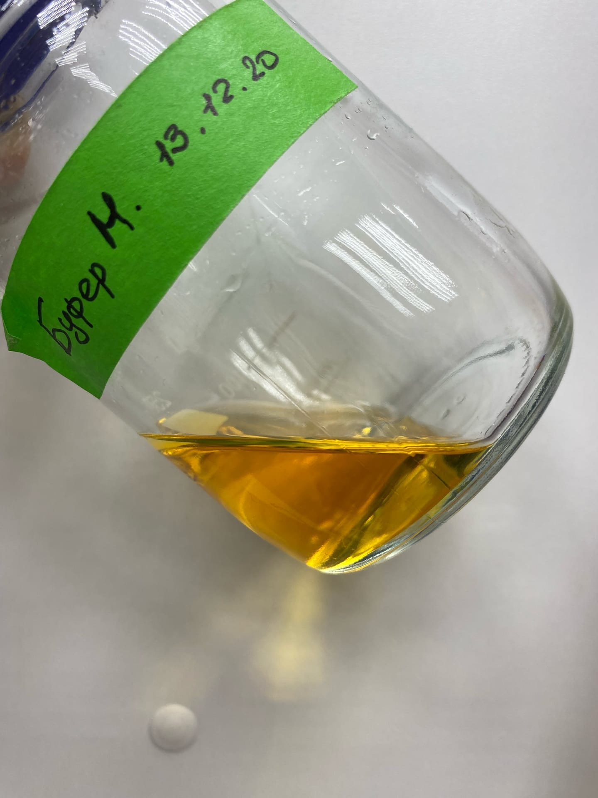

{}
Буфер M применяется для элюции ДНК из агарозного геля на колонках с силикой.
{}

### Необходимые компоненты

-   **Изотиоционат гуанидина**

-   Краситель **Крезоловый красный**

-   **mQ**

-   [1М Трис-HCl](/labreagents/buffers/tris) pH 7.4

-   [0,5M EDTA](/labreagents/buffers/edta), pH 8.0

-   3M [NaOAc](/labreagents/buffers/naoac), pH 5.0

### Буфер N

|                                                           | Содержание | 50 мл  | 100 мл | 150 мл | 200 мл | 250 мл  | 1 л   |
|-----------------------------------------------------------|------------|--------|--------|--------|--------|---------|-------|
| **GuSCN** (Mw 118.16)                                     | 3.31 М     | 22.5 г | 45 г   | 67.5 г | 90 г   | 112.5 г | 450 г |
| [**1M Tris-HCl**](/labreagents/buffers/tris) **(pH 7.4)** | 50 мМ      | 2.5 мл | 5 мл   | 7.5 мл | 10 мл  | 12.5 мл | 50 мл |
| [**0.5М ЭДТА**](/labreagents/buffers/edta) **(pH 8.0)**   | 10 мМ      | 1 мл   | 2 мл   | 3 мл   | 4 мл   | 5 мл    | 20 мл |

-   Добавить mQ до 80% объема от запланированного

-   Растворить гуанидин

-   Добавить крезоловый красный на кончике лезвия, пока цвет не станет насыщенным

-   Если цвет раствора красный, то добавлять по каплям 3M **NaOAc**, пока раствор не преобретет оранжево-желтый оттенок.

-   Довести объем до запланированного добавлением mQ

{}
Окраска готового раствора должна быть как на фотографии ниже.
{}

